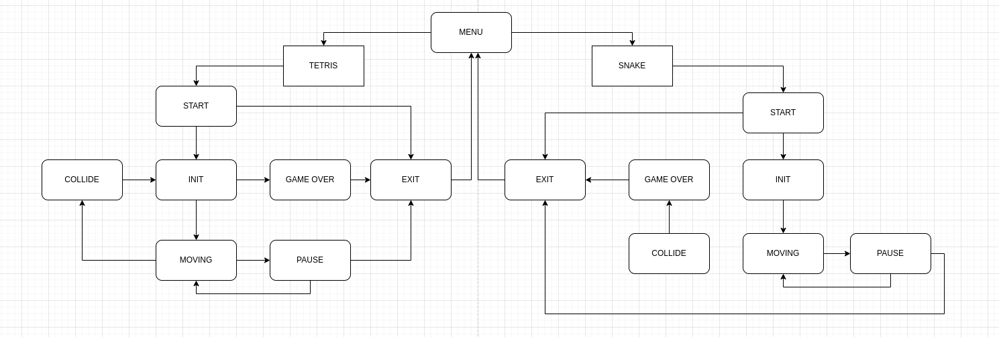

# NeoSnake

NeoSnake is a set of classic games that includes the snake game and bonus Tetris. As per the assignment, an enhanced version of classic games, Snake and Tetris, was developed using C++ and OOP principles using the C++17 standard.

The project follows the MVC pattern, with a clear separation between game logic and the graphical interface. For the visual part of the project, both the Qt framework, which provides a user-friendly interface and smooth animations, and a console interface for displaying the game can be used. The design ensures that the game logic is modular and easy to maintain, allowing for future enhancements and modifications.

## Contents

1. [Requirements](#requirements)
2. [Project Structure](#project-structure)
3. [Usage](#usage)
4. [Gameplay](#gameplay)
5. [Testing](#testing)
6. [Finite State Machine Diagram](#finite-state-machine-diagram)

## Requirements

- Operating system: Linux or macOS
- C++17 compiler
- ncurses library (for the terminal interface of the game)
- GUI library with API for C++17 (Qt) (for the graphical interface of the game)
- GTest library (for unit tests)

## Project Structure

- `src/brick_game/snake` - code of the library with the logic of the snake game
- `src/brick_game/tetris` - code of the library with the logic of the Tetris game
- `src/controller` - controller code
- `src/gui/console` - code of the terminal interface
- `src/gui/desktop` - code of the graphical interface
- `tests` - unit tests for libraries (GTest)
- `Makefile` - file for building the project

## Usage

Install the game:
```bash
cd src
make install
```

Launch the desktop version of the game:
```bash
  cd src
  make desktop 
```


Launch the console version of the game:
```bash
  cd src
  make cli 
```


## Gameplay

### Snake

- The snake moves across the field on its own, moving forward by one block after the game timer expires.
- When the snake collides with an "apple", its length increases by one.
- When the snake's length reaches 200 units, the game ends in victory.
- When the snake collides with the edge of the field or with itself, the game ends in defeat.
- The user can change the direction of the snake's movement using the arrows, with the snake being able to turn only left and right relative to its current direction of movement.
- The user can speed up the snake's movement by holding down the arrow in the direction of the snake's movement.

#### Controls

- Space - Start the game
- Space / Tab - Pause the game / resume the game
- Esc - End the game
- Left arrow - Move the snake to the left
- Right arrow - Move the snake to the right
- Down arrow - Move the snake down
- Up arrow - Move the snake up

### Tetris

#### Controls

- Space - Start the game
- Tab - Pause the game / resume the game
- Esc - End the game
- Left arrow - Move the tetromino to the left
- Right arrow - Move the tetromino to the right
- Down arrow - Accelerate the movement of the tetromino down
- Up arrow - Rotate the tetromino
- Space - Drop the tetromino

## Additional Mechanics

### Scoring and Record

- Scoring
- Storage of the maximum number of points in a file
- Scoring:
    - Snake: one point is added for eating each "apple"
    - Tetris:
        - 1 line - 100 points
        - 2 lines - 300 points
        - 3 lines - 700 points
        - 4 lines - 1500 points

### Level Mechanics

- Level mechanics
- Every time the player scores a certain number of points, the level increases by 1
    - Snake: every 5 points
    - Tetris: every 600 points
- Increasing the level increases the speed of the snake or figures
- Maximum number of levels - 10

## Testing

The libraries implementing the game logic are covered by unit tests using the gtest library.
Run the tests:
```bash
make test
```

## Finite State Machine Diagram


